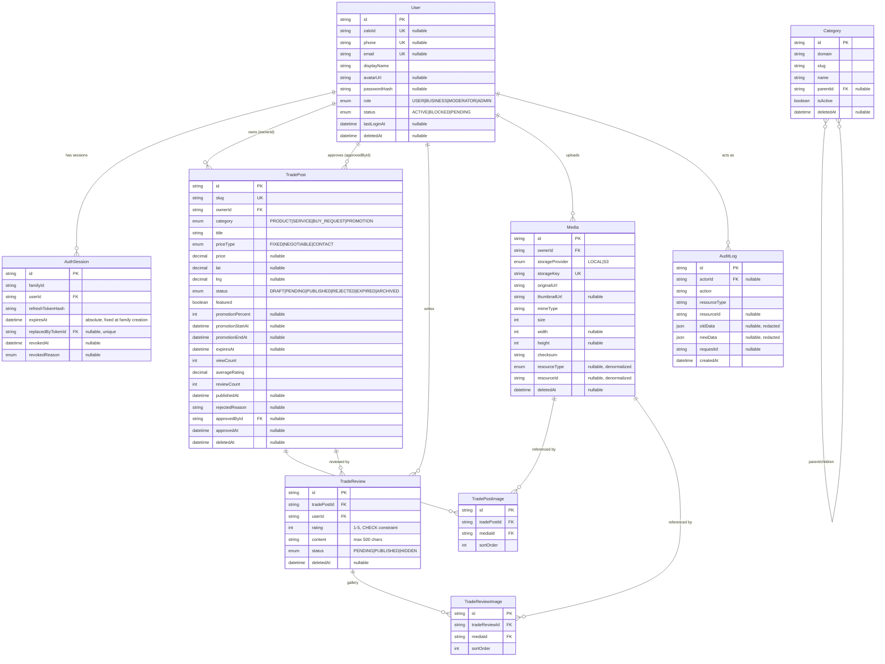

# ERD — Phase 1 (Foundation, Auth, Media, Trade + Reviews)

Covers every table that exists in `prisma/schema.prisma` today. The 14 read-only content-domain tables, Favorite, FeedbackTicket/FeedbackAttachment tables do not exist yet (Phase 2+) — `Category` and `AuditLog` are built now as shared infra ahead of their real consumers (see `docs/assumptions.md`).

## Notes on cardinality and integrity

- `TradeReview` has no schema-visible unique constraint for "one active review per user per post" — it's enforced by a hand-written **partial unique index** (`WHERE deletedAt IS NULL`) applied in a follow-up raw-SQL migration, since Prisma's schema DSL can't express a filtered unique constraint. See `docs/assumptions.md`.
- `Media.resourceType`/`resourceId` are denormalized, nullable pointers only — `TradePostImage`/`TradeReviewImage` are the authoritative galleries (a two-phase upload: media is uploaded and gets an id *before* the parent TradePost/TradeReview exists).
- `TradePost.ownerId` → `onDelete: Restrict` (a user can't be hard-deleted out from under their own posts); `TradePost.approvedById` → `onDelete: SetNull` (losing the approving moderator doesn't invalidate the post).
- `AuditLog.actorId` → `onDelete: SetNull` — audit history survives user deletion.
